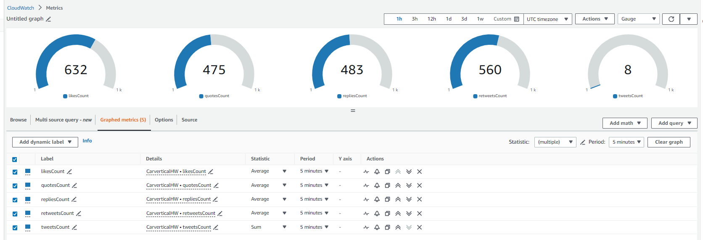

# Serverless X (formerly Twitter) Message Streaming App

This project comprises three main components: API, Messages Streams Consumer, and Data Processor.

## API

The API Lambda consists of two groups of endpoints: private and public.

### Private Endpoints (`/private-api`)

1. **POST `/stream`**
    - Initiates a stream of messages from X.
    - Accepts keywords to filter incoming tweets in the request body:
        ```json
        {
            "keywords": ["", "", ..., ""]
        }
        ```

2. **DELETE `/stream`**
    - Stops an existing stream.
    - Requires `streamId` to be passed in the request body.
        ```json
        {
            "streamId": ""
        }
        ```

### Public Endpoints (`/public-api`)

1. **GET `/tweets`**
    - Retrieves already collected tweets from the database.
    - Requires the additional query parameter `countryCode` to be passed, e.g.:
        ```
        GET /tweets?countryCode=VU
        ```
        Response:
        ```json
        {
            "data": [
                {
                    "tweetId": "576",
                    "text": "impedit qui odio",
                    "metrics": {
                        "retweets": 654,
                        "replies": 146,
                        "likes": 523,
                        "quotes": 68
                    },
                    "id": "ff41e72d-0c42-4f39-a5b5-b13185a12087",
                    "countryCode": "VU"
                }
            ]
        }
        ```

2. **GET `/tweets/:id`**
    - Gets a particular tweet by its ID, which can be found using the above endpoint, e.g.:
        ```
        GET /tweets/ff41e72d-0c42-4f39-a5b5-b13185a12087
        ```
        Response:
        ```json
        {
            "data": {
                "tweetId": "576",
                "text": "impedit qui odio",
                "metrics": {
                    "retweets": 654,
                    "replies": 146,
                    "likes": 523,
                    "quotes": 68
                },
                "id": "ff41e72d-0c42-4f39-a5b5-b13185a12087",
                "countryCode": "VU"
            }
        }
        ```

Trigger: API Request.

## Messages Streams Consumer

This Lambda is responsible for querying the X API, receiving tweets, and sending them to an SQS queue for further processing. It gets invoked by the API and cannot be directly called from the outside.

Trigger: Invoked directly by another Lambda.

## Data Processor

This component is responsible for processing messages that the Streams Lambda received. Processing involves saving the payload into DynamoDB and sending custom metrics to CloudWatch for further analysis.

Trigger: SQS queue message.

CloudWatch Custom Metrics:

Shows an average of tweets likes, retweets, other parameters and a sum of tweets sample.

